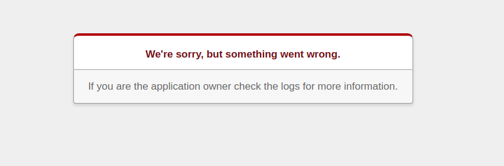
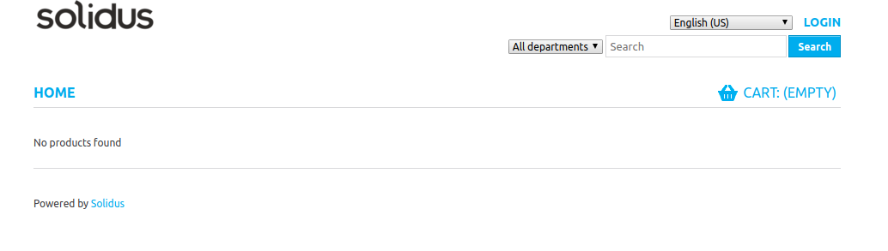
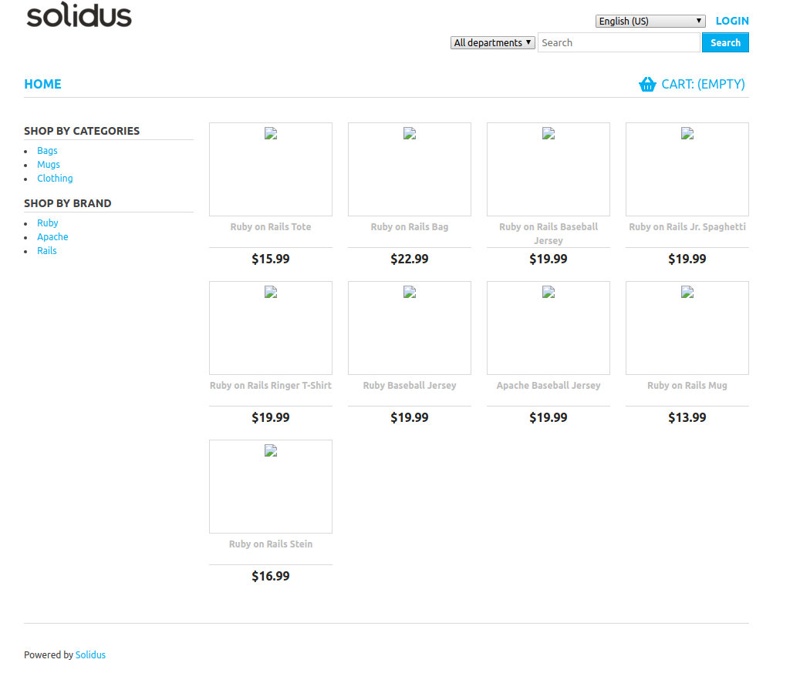
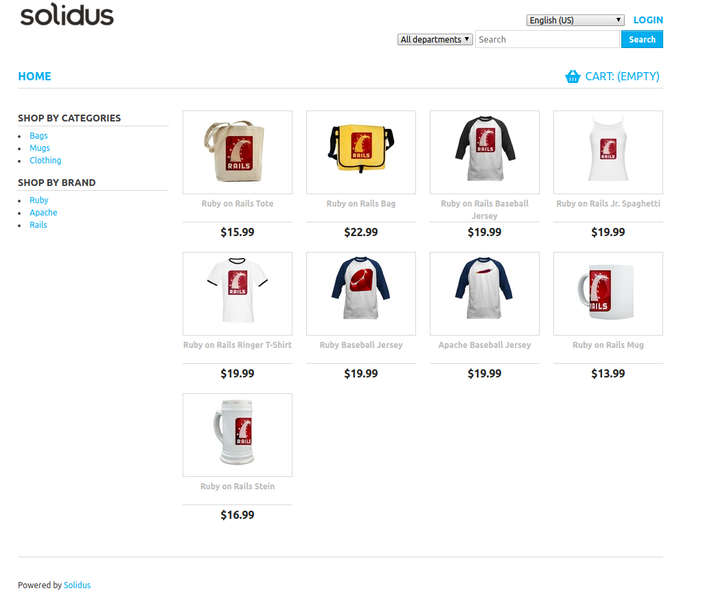
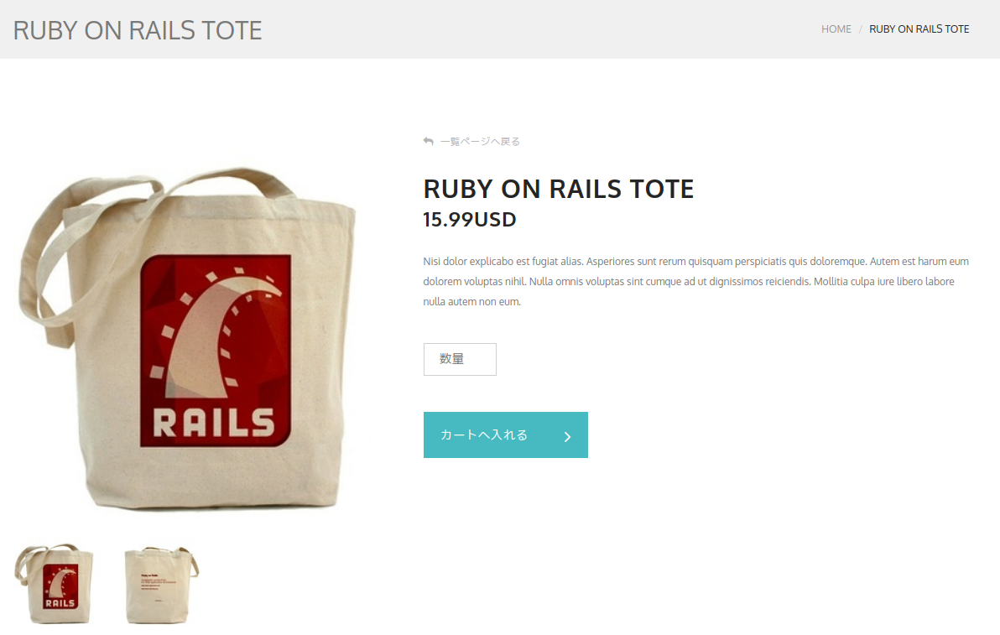

# Herokuデプロイ手順
ここではローカル環境で動作させているpotepanecアプリケーションをHerokuにデプロイする手順を説明します。

# ゴール
- ローカルと同じ動作がHeroku上でも実現できていること
- ユニークなURLが生成され、誰でもアクセス出来る状態になっていること

# 準備
HerokuへのデプロイにはHeroku CLIを利用します。[インストール](https://devcenter.heroku.com/articles/heroku-cli#download-and-install)しておきましょう。

# 初めてのデプロイ
## HerokuへDeploy
うまくいくかどうかわかりませんが、まずはHerokuにデプロイするまでの手順を一通り行ってみましょう。

まずはHeroku上に空のアプリケーションを作成します。

```sh
$ heroku create
```

次にHeroku上にコードをデプロイします。
ここではデプロイしたいブランチ名を`testbranch`と仮定します。

```sh
$ git push heroku testbranch:master
```

デプロイが無事完了すると以下のようなメッセージが表示されます。

```
https://nameless-plateau-03743.herokuapp.com/ deployed to Heroku
```

URLはHerokuによってランダムに割り当てられます。このURLがあなたのアプリケーションのURLとなります。
試しにブラウザでアクセスしてみましょう。



おっと、何やらエラー画面が表示されています。
なぜエラーになっているのかを確認してみましょう。

```sh
$ heroku logs --source=app --tail
...
2019-10-09T22:58:43.09581+00:00 app[web.1]: F, [2019-10-09T22:58:43.095741 #4] FATAL -- : [a5c760b6-7ccb-4009-9b26-b66de590879c] Mysql2::Error::ConnectionError (Can't connect to local MySQL server through socket '/tmp/mysql.sock' (2)):
...
```

どうやらデータベース(MySQL)に接続できていないようです。

これはHeroku上でRailsがアクセスするデータベースの情報が正しく設定されていないことが原因です。

## データベースの作成
Railsでは[環境毎に異なる設定を持たせることが可能](https://railsguides.jp/configuring.html#rails%E7%92%B0%E5%A2%83%E3%82%92%E4%BD%9C%E6%88%90%E3%81%99%E3%82%8B)です。これを利用してHeroku上での環境である`production`環境でデータベースに接続できるようにしましょう。

まずは接続するデータベースを作成していきます。

Herokuには[JawsDB](https://elements.heroku.com/addons/jawsdb)というMySQLデータベースを作成するためのプラグインが存在するため、これを利用します。

JawsDBは無料で使うことができますが、利用するためにはクレジットカード情報をHerokuに登録する必要があります。(実際に料金が請求されることはないので安心してください。)

[Herokuのアカウント情報](https://dashboard.heroku.com/account/billing)にアクセスし、クレジットカード情報を登録してください。

登録が完了したら以下のコマンドを実行します。

```sh
$ heroku addons:create jawsdb:kitefin
```

次にRailsに作成したデータベースの接続情報を追加していきます。
`config/database.yml`にある`production`の設定情報を以下のように変更してください。

```yml
production:
  <<: *default
  url: <%= ENV['JAWSDB_URL']&.sub('mysql://', 'mysql2://') %>
```

`JAWSDB_URL`は先程設定したJawsDBプラグインから提供される環境変数で、データベースに接続するためにURLが格納されています。

以上でデータベースの設定は完了です。

変更をcommitして、再度Herokuにデプロイしましょう。

```sh
$ git commit -a -m "Look for env var defined by JAWSDB addon on production"
$ git push heroku testbranch:master
```

デプロイが完了したら、もう一度URLにアクセスしてみましょう。


うーん、また同じエラー画面が表示されてしまいました。ログを見てみましょう。

```sh
$ heroku logs --source=app --tail
...
2019-10-09T23:45:05.229224+00:00 app[web.1]: F, [2019-10-09T23:45:05.229087 #4] FATAL -- : [dc87c41d-991b-4104-832d-5be8179f7150] ActiveRecord::StatementInvalid (Mysql2::Error: Table 'bcylltkygs644e41.spree_stores' doesn't exist: SHOW FULL FIELDS FROM `spree_stores`):
...
```

おっ、今度はエラーメッセージが変わりましたね。`spree_stores`というテーブルが存在していないようです。

これはデータベースには正常に接続できているものの、Solidusが必要とするテーブルが作成されていないことを意味します。

## データベースの設定
Solidusが必要とするテーブル、および初期データを作成していきましょう。

まずはテーブルの作成です。
```sh
$ heroku run bin/rails db:migrate
```
`heroku run`は与えられた任意のコマンドをHeroku上で実行するコマンドです。
ここでは `bin/rails db:migrate`を実行し、必要なテーブルを作成しています。

また、下記コマンドも実行もしてSample Storeのテーブルを作っておきましょう。
これを実行しないと商品をカートに入れる実装をした時にエラーカート系のテーブルがなくエラーが起こります。
```sh
$ heroku run bin/rails runner 'Spree::Store.create!(name: "Sample Store", code: "sample-store", url: "example.com", mail_from_address: "store@example.com")'
```

これで必要なテーブルは作成できたはずです。アプリケーションのURLにアクセスしてみましょう。



見事、正常な画面が表示されましたね! 🎉

しかし、まだ問題があります。商品のデータが存在しません。

幸運にもSolidusではサンプルデータを作成するための方法を用意してくれています。
以下のコマンドを実行して、サンプルデータを作成しましょう。

```sh
$ heroku run bin/rails runner "['products', 'taxons', 'option_values', 'product_option_types', 'product_properties', 'variants', 'assets'].each { |table| Spree::Sample.load_sample(table) }"
```

実行が完了したらアプケーションのURLにアクセスしてみましょう。



商品データが追加されていることは確認できました。しかし、画像が表示されていません。なぜでしょうか?

Herokuのローカルストレージは[ephemeral filesystem](https://devcenter.heroku.com/articles/dynos#ephemeral-filesystem)を採用しています。これはSolidusが画像の保存に使っている[paperclip gem](https://github.com/thoughtbot/paperclip)では非対応なので、画像ファイルの保存に失敗しているのが原因です。

### 補足
通常であれば `heroku run bin/rails g spree:install`を実行することでサンプルデータも同時に作成されます。しかし、これを実行した時にデータベースに発行されるクエリの回数がJawsDBの無料プランの上限を超えてしまいエラーになってしまいます。

ここでは代わりに必要なサンプルデータだけを作成するコマンドを実行することで、無料プランによる制限に引っかかるのを回避しています。

## AWS S3との連携
ページにアクセスした時に画像が正常に表示されるようにするために、[AWS S3](https://aws.amazon.com/jp/s3/)と連携する設定を行いましょう。

AWS S3はクラウド上のストレージにファイルを保存、ダウンロードすることができるサービスです。多くの画像を扱うライブラリはこれに対応しており、Solidusが使っている[paperclip gem](https://github.com/thoughtbot/paperclip)もシームレスに連携することができます。

ここではAWSの無料枠を使ってS3とアプリケーションを連携し、商品画像を保存した時にS3にそのファイルが保存されるようにします。また、商品ページにアクセスした時にS3から画像をダウンロードし、ブラウザに表示されるようにします。

### AWSアカウントの作成
まずはAWSのアカウントを作成しましょう。以下のURLから手順に従って情報を入力してください。
https://portal.aws.amazon.com/billing/signup

AWSにはいくつかのサービスで[無料枠](https://aws.amazon.com/jp/free/?all-free-tier.sort-by=item.additionalFields.SortRank&all-free-tier.sort-order=asc)があり、S3では5GBまで無料で使えます。途中、クレジットカード情報を入力する場面がありますが、無料枠内であれば実際に請求されることはないので安心してください。

### IAMユーザーの作成
アカウントが作成できれば、次は[IAM](https://console.aws.amazon.com/iam/home?region=ap-northeast-1#/home)ユーザーを作成します
IAMはAWSサービスの1つで、簡単に言うと先ほど作成したAWSアカウントに紐づくユーザー情報を作成・編集・削除出来るものです。IAMユーザーには各AWSサービスに対する権限、例えば「S3に画像をアップロードする権限」を設定できます。

ここではSolidusアプリケーションに設定するためのユーザー、`potepanec`ユーザーを作成し、必要な権限を付与していきましょう。

まずは[AWS IAM](https://console.aws.amazon.com/iam/home?region=ap-northeast-1#/home)のページにアクセスします。

左のメニューから`User`->`Add user`を選択し、以下の情報を入力してください。
- User nameは`potepanec`
- Access typeは`Programmatic access`にチェックを入れる
- Add permission -> Attach existing policies directly から`AmazonS3FullAccess`を選択する
- Tagは何も入れなくてOK

ユーザーが作成されると`Download .csv`からアクセス情報をダウンロードしておきましょう。
このファイルは後にpotepanecアプリケーションとAWS連携させる際に必要になるのでどこかに保存しておいてください。

### S3バケットの作成
バケット(bucket)とはS3上のフォルダのようなもので、ファイルを保存したり、さらにその下にフォルダを作成することができます。

AWS CLIを使ってバケットを作成するので、まずはAWS CLIをインストールしましょう。

```sh
$ brew install awscli
```

インストールが完了したことが確認できれば、先ほどダウンロードした`potepanec`ユーザーの情報が記載されたCSVファイルを参照しながら、AWS CLIの設定を行いましょう。

```sh
$ aws configure
AWS Access Key ID [None]: （potepanecユーザーのAccess key ID）
AWS Secret Access Key [None]: （potepanecユーザーののSecret access key）
Default region name [None]: ap-northeast-1
Default output format [None]: json
```

設定できればAWS CLIを使ってバケットを作成します。

```sh
$ aws s3 mb s3://potepanec
make_bucket: potepanec
$ aws s3api put-bucket-acl --bucket potepanec --acl public-read
$ aws s3 ls
2019-10-12 10:20:01 potepanec
```

3つ目のコマンドで作成したバケットが表示されれば完了です。

### paperclip gemの設定
最後にpotepanecアプリケーションとS3を連携させ、商品画像がS3に保存されるようにしましょう。

まずは`aws-sdk` gemを追加します。

```sh
$ bundle add aws-sdk --version '~>2.3'
```

次にAWSのアカウント情報、およびS3のバケット情報をpaperclipに伝える設定を行います。
[Paperclipのガイド](https://github.com/thoughtbot/paperclip/wiki/Paperclip-with-Amazon-S3)を参考にして`config/environments/production.rb`に必要な変更を加えましょう。

```diff
--- a/config/environments/production.rb
+++ b/config/environments/production.rb
@@ -91,4 +91,16 @@ Rails.application.configure do

   # Do not dump schema after migrations.
   config.active_record.dump_schema_after_migration = false
+
+  config.paperclip_defaults = {
+    storage: :s3,
+    preserve_files: true,
+    s3_host_name: 's3-ap-northeast-1.amazonaws.com',
+    s3_credentials: {
+      access_key_id: ENV['AWS_ACCESS_KEY_ID'],
+      secret_access_key: ENV['AWS_SECRET_ACCESS_KEY'],
+      s3_region: 'ap-northeast-1'
+    },
+    bucket: 'potepanec'
+  }
 end
```

ここでは`AWS_ACCESS_KEY_ID`と`AWS_SECRET_ACCESS_KEY`という環境変数から、IAMユーザーの認証情報を取得するようにしています。環境変数を使っているのはセキュリティ上の懸念からです。認証情報をそのままコード内に記述してGitHubなどの不特定多数のユーザーがアクセスできる環境に公開されてしまうと、それを悪用される可能性があります。注意しましょう。

Herokuにデプロイした時に、potepanecアプリケーションがこの環境変数を取得できるようにheroku CLIを使って設定します。

```sh
$ heroku config:set AWS_ACCESS_KEY_ID=(potepanecユーザーのAccess key ID) AWS_SECRET_ACCESS_KEY=(potepanecユーザーのSecret access key)
```

最後に、この変更を加えた状態でherokuにデプロイします。

```sh
$ git commit -a -m "Configure Paperclip to use S3"
$ git push heroku testbranch:master
```

デプロイが完了したら登録されてある全ての商品画像をS3にアップロードし直すためのタスクを実行します。

```sh
$ heroku run bin/rails _asset_loader:_force_reload:setup
```

以上でおしまいです! 商品画像が表示されましたか?



念の為、課題で実装したページでも画像が表示されていることを確認しておきましょう。


